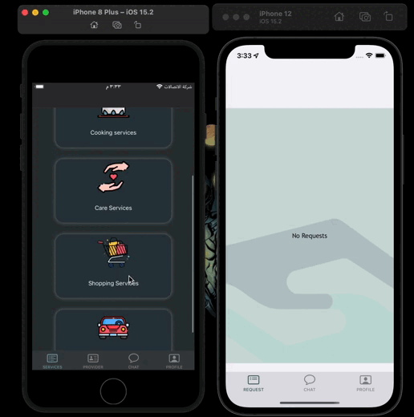
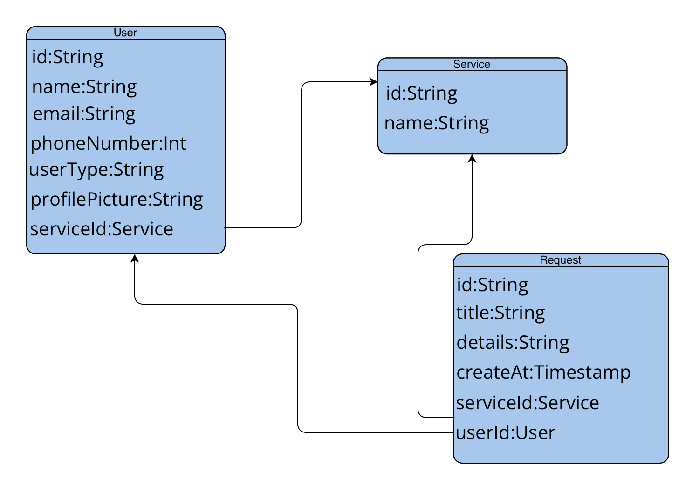
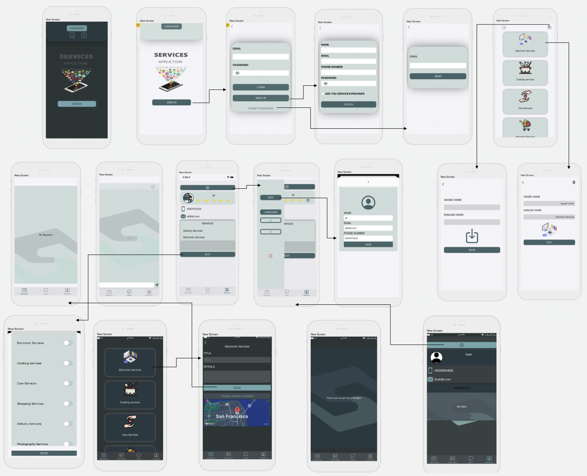

# Servecis App

## Description

- Services application: It allows those who want to work in various and different fields and get additional income, they can easily get through the application. It also allows those who want someone to do the work for them to get service providers easily.

## Demo

- Arabic Language

## user Stories 
###Requester
- As requester , I can log in to the app.
- As requester , I can choose the service.
- As requester , I can write the service details.
- As requester , I can send the service.
- As requester , I can cancel the service.
- As requester , I can talk with the service provider.
- As requester , I can edit my profile.
- As requester , I can rate the service provider

###Service Provider
- As  service provider, I can login to the app.
- As  service provider, I can choose the services that I will provide.
- As  service provider, I can view the service details, accept it and set a price.
- As  service provider, I can talk with the requester.
- As  service provider, I can edit my profile.

## Framework
- UIKit
- Firebase
- AVFoundation
- CoreLocation
- IQKeyboardManagerSwift
- AMKeyboardFrameTracker
- Mapkit

## ERD

## Wireframe

